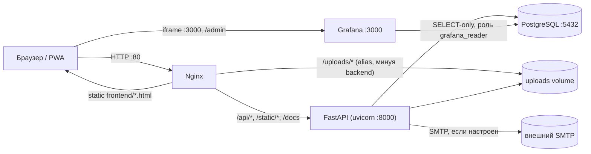

# Архитектура «GoodWill»

Актуально на Alembic-миграции `99d6ab27f54c` … `b3c8e1f4a927`. Обновляйте этот файл при
значимых архитектурных изменениях.

## Компоненты (docker-compose.yml)



- **backend**: единственный сервис с бизнес-логикой; на старте (`entrypoint.sh`) прогоняет
  `alembic upgrade head`, затем всегда идемпотентно засеивает справочник учреждений
  (`app/db/seed_institutions.py`), администратора из `ADMIN_*` в `.env`
  (`app/db/seed_admin.py`, пропускается, если переменные пустые или пользователь уже
  есть) и справочный контент — участки побережья/курсы/ачивки (`app/db/seed_content.py`),
  затем поднимает uvicorn. Ничего из этого не гейтится флагом — весь сидинг безопасен для
  повторного запуска на уже заполненной БД.
- **nginx**: единственная точка входа снаружи (порт 80). Раздаёт `frontend/` как статику,
  проксирует `/api/`, `/static/`, `/docs|/redoc|/openapi.json` на backend, отдаёт
  `/uploads/` напрямую с диска (без похода в backend).
- **grafana**: отдельный порт (3000, не через nginx — браузер ходит туда напрямую, в том
  числе для iframe на `/admin`, см. ниже). Ходит в ту же Postgres-БД под read-only ролью
  `grafana_reader` (создаётся миграцией `e5f2a9c31d08`), датасорс и дашборд
  провизионируются из `grafana/provisioning/`. Анонимный доступ уровня Viewer +
  `GF_SECURITY_ALLOW_EMBEDDING=true` включены (`docker-compose.yml`) специально ради
  встраивания в iframe без отдельного логина — это открывает сам дашборд (агрегаты, без
  персональных данных) всем, кто достучится до порта 3000; закрывайте порт файрволом на
  проде, если это нежелательно (см. README, раздел про VDS).
- **db**: Postgres 16, инициализируется **только на первом старте пустого volume**
  значениями `POSTGRES_USER/PASSWORD/DB` из `.env` (стандартное поведение official-образа
  `postgres`) — смена `.env` после первого запуска не меняет пароль уже существующей
  роли внутри уже существующего volume; нужно либо руками поменять пароль роли
  (`ALTER ROLE ... PASSWORD ...` через `psql`), либо снести volume `pgdata` (потеря
  данных). Сервис живёт за Compose-профилем `local-db` (включён по умолчанию через
  `COMPOSE_PROFILES=local-db` в `.env`) — backend и Grafana подключаются к
  `${DB_HOST:-db}:${DB_PORT:-5432}`, так что для внешней БД (не из этого compose)
  достаточно поменять `DB_HOST`/`DB_PORT` и очистить `COMPOSE_PROFILES`, чтобы локальный
  контейнер не запускался (см. README, «База данных: внутри Docker или снаружи»);
  backend/grafana зависят от `db` через `depends_on: required: false` — мягкая
  зависимость, не требующая, чтобы профиль был активен. В dev/тестах backend вместо
  Postgres может работать на SQLite (`DATABASE_URL` не задан) — тесты используют
  in-memory SQLite напрямую через `Base.metadata.create_all`, миграции Alembic в тестах
  не участвуют.

## Backend: слои

```
app/api/v1/*        FastAPI-роутеры (по одному на домен: auth, users, events,
                     admin_tickets, notifications, lessons, reports, sites, gamification, admin)
app/schemas/*        Pydantic-модели запросов/ответов (1:1 с моделями в app/models)
app/services/*        Бизнес-логика, переиспользуемая между роутерами:
                     gamification.py  — award_points/check_achievements/update_streak
                                        (единственное место, где меняются points_total,
                                        включая начисление очков организации-организатору)
                     notifications.py — notify() — единственная точка создания Notification
                     verification.py  — email-код подтверждения (генерация/проверка), умеет слать
                                        код на другой адрес (target_email) для смены email
                     email.py         — HTML-письма (лого/брендовые цвета) через aiosmtplib
                                        (no-op + лог, если SMTP не настроен)
                     uploads.py       — save_upload_image(): общая валидация типа/размера и
                                        сохранение в uploads/<subdir>/ (аватары, ачивки, рамки, репорты)
                     gosuslugi.py     — ЗАГЛУШКА интеграции с ЕСИА (is_configured()==False всегда,
                                        пока не заданы GOSUSLUGI_* в .env)
                     inn.py           — проверка контрольной суммы ИНН (10/12 цифр)
app/models/*          SQLAlchemy 2.0 ORM-модели (Mapped[...]), сгруппированы по файлам-доменам
app/core/{config,deps,security}.py   настройки (.env), FastAPI-зависимости (auth/роли,
                     ensure_organization_approved), JWT/bcrypt
app/db/seed_institutions.py   идемпотентный сид справочника Team (школы/вузы/колледжи из
                     app/db/data/institutions_rostov.json)
app/db/seed_admin.py           бутстрап единственного администратора из ADMIN_* в .env
app/db/seed_content.py         идемпотентный сид участков побережья/курсов/ачивок
                     (все три вызываются в entrypoint.sh всегда, без флагов)
```

Паттерн ролевого доступа: `require_roles(*roles)` в `app/core/deps.py` — фабрика
FastAPI-зависимостей. Для сущностей с владельцем (мероприятия, курсы) используется
дополнительная ручная проверка `_ensure_*_owner(entity, user)` (владелец ИЛИ admin), а не
отдельная роль — это позволяет волонтёру, предложившему мероприятие, управлять именно им.
Аналогично `ensure_organization_approved(user)` в `app/core/deps.py` — вызывается вручную
(не как `Depends`) в начале `POST /events` и `POST /lessons`, поднимает 403, пока
`Organization.status != approved` у организатора-автора (у волонтёров и админа
`organization` нет/не проверяется).

Волонтёрские механики начисления баллов (`POST /events/{id}/register`, `/checkin`,
`POST /reports` (отправка репорта), `POST /lessons/{id}/complete`) явно ограничены
`role == volunteer` — organizer/admin получают 403. Это отражает разделение ролей и на
фронтенде (см. ниже): организатор/админ физически не видят этих действий в UI, а
проверка на бэкенде — защита от прямых запросов к API в обход интерфейса.

## Данные: сквозные жизненные циклы

**Мероприятие** (`Event.status`): `pending_review` (по умолчанию при создании, автором
может быть волонтёр или организатор, не admin) → `published` (одобрено админом в
`/admin/tickets/events/{id}/approve` или `edit-approve`) | `rejected` (с обязательной
причиной → уведомление автору). Для `event_type=cleanup` обязателен `site_id`
(привязка к `CoastlineSite` — центральная связь с ДЗЗ-историей продукта).

**Заявка на мероприятие** (`EventRegistration.status`): `pending` (при подаче) →
`approved`/`rejected` (решение организатора-владельца, reject требует причины) →
`checked_in` (гео-чекин участника, доступен только из `approved`; начисляет баллы,
обновляет `update_streak`, будущей организации-владельцу события — если есть).

**Курс** (`Lesson.status`): `draft` (создан organizer/admin) → `pending_review`
(`POST /lessons/{id}/submit`) → `published` (тикет `/admin/tickets/courses/{id}/approve`
или `edit-approve`) | `rejected`. Admin-созданные курсы публикуются сразу. Ровно один
курс в системе может иметь `is_base_course=True` (`POST /lessons/{id}/set-base-course`,
admin-only) — его прохождение обязательно перед подачей заявки на `cleanup`-мероприятие
(вместе с `age_verified`). Мероприятие может дополнительно требовать конкретный
опубликованный курс через `Event.prerequisite_lesson_id`
(`POST /events/{id}/attach-course`).

**Организация** (`Organization.status`): `pending` (по умолчанию при организаторской
регистрации через ИНН) → `approved`/`rejected` (решение админа в
`/admin/tickets/organizations/{id}/approve|reject`, reject требует причины →
уведомление всем пользователям организации). Пока не `approved`, организатор из этой
организации может войти и просматривать платформу, но `POST /events` и `POST /lessons`
вернут 403 (`ensure_organization_approved`, см. выше). Организации, существовавшие до
введения этой миграции, при апгрейде переводятся в `approved` автоматически (бэкфилл в
миграции `8eb626abc523`), чтобы не заблокировать уже работающих организаторов.

**Тикеты админа** (`app/api/v1/admin_tickets.py`, admin-only) — точка модерации для
мероприятий, курсов и организаций: approve / reject (причина обязательна, уходит через
`notify()`) / edit-approve для мероприятий и курсов (правки применяются, затем
публикация). Репорты о мусоре модерируются отдельным, более старым эндпоинтом
`POST /reports/{id}/moderate` (`require_organizer` — доступен и организатору, и админу,
не только админу, в отличие от мероприятий/курсов/организаций), на фронтенде это отражено
в `reports.html` (см. ниже), а не в `tickets.html`.

**Ачивки** (`Achievement`) — управляются только через админский CRUD
(`POST/PATCH/DELETE /admin/achievements`, `.../image`, `.../frame-image`), больше не
хардкожены только в сиде: `app/db/seed_content.py` лишь предзаполняет стартовый набор,
дальше админ может добавлять свои через `/admin` (иконка-эмодзи ИЛИ загруженная картинка
в `image_url`; рамка аватара — пресет `avatar_frame_code` (см. `frame-*` классы в
`css/style.css`) ИЛИ загруженная картинка-рамка в `avatar_frame_image_url` — на фронтенде
картинка всегда приоритетнее пресета/эмодзи при наличии).

## Frontend

Multi-page vanilla JS (без сборки), один `js/api.js` на все страницы (JWT в localStorage,
авто-refresh при 401), `js/ui.js` — общие хелперы (skeleton-заглушки, toast, dropdown).
Дизайн-система и анимации живут в `css/style.css` (токены отступов/переходов, `@keyframes`
для появления карточек, skeleton-шиммера, модалок и dropdown; уважает
`prefers-reduced-motion`).

Разделение по роли — **полное**, не только пункты меню: `js/nav.js` строит для каждой роли
свой набор ссылок (не «общий список + добавки»):

| Роль | Меню |
|---|---|
| volunteer / гость | Главная · Карта · Уроки · Мероприятия · Репорты · Лидерборд |
| organizer | Главная · Карта · Курсы → `/lessons` · Мои мероприятия → `/organizer` · Репорты → `/reports` · Лидерборд |
| admin | Главная · Карта · Тикеты → `/tickets` · Статистика → `/admin` · Репорты → `/reports` · Лидерборд |

`lessons.html` и `reports.html` (физические файлы на диске не переименованы — см. про
чистые адреса ниже) — одни и те же файлы для всех ролей, но сами адаптируют контент:
`lessons.html` показывает волонтёру прохождение квиза за баллы, а organizer/admin —
только чтение материала и авторские инструменты (если это их курс); `reports.html`
показывает волонтёру форму отправки репорта, а organizer/admin — очередь модерации
(перенесена из `tickets.js`, который теперь отвечает только за мероприятия и курсы).
Форма создания мероприятия живёт только в `organizer.html` (не в `events.html`, который
теперь — чисто участие волонтёра: заявка + гео-чекин), и включает карту Яндекс.Карт для
точной метки места (см. ниже) в дополнение к выбору `CoastlineSite` для уборок. Колокольчик
уведомлений — выпадающий dropdown (`js/nav.js` + `js/ui.js#initDropdown`), а не переход на
отдельную страницу; `notifications.html` остаётся как полная история.

Каждая страница, доступная не всем ролям (`organizer.html`, `tickets.html`, `admin.html`),
сама проверяет роль при загрузке и показывает «Доступно только …» неавторизованным ролям
(защита на бэкенде обязательна и первична — фронтовая проверка только для UX и для того,
чтобы не показывать элементы интерфейса, которые всё равно приведут к 403).

**`/admin`**: не собственная статистика (raw-запросы `/admin/stats`/`/admin/events` в
backend всё ещё существуют и работают, но фронтенд их больше не вызывает) — вместо этого
`js/admin.js` встраивает Grafana-дашборд `chistybereg-activity` через `<iframe>`
(`${location.hostname}:${GRAFANA_PORT}` из `js/config.js`), с ссылкой-фолбэком на прямое
открытие дашборда на случай, если iframe не загрузился (например, из-за mixed content —
если сайт на HTTPS, а Grafana только на HTTP, браузер заблокирует именно iframe, но не
переход по ссылке в новой вкладке).

**Чистые адреса**: все внутренние ссылки и редиректы используют пути без `.html`
(`/events`, `/profile`, …) — сами файлы на диске остаются `events.html`, `profile.html` и
т.д., это только правило `try_files $uri $uri.html $uri/ /index.html;` в
`nginx/nginx.conf`. Не убирайте суффикс `.html` из имён файлов и не добавляйте его
обратно в новые ссылки внутри `frontend/js/*.js`/`*.html`.

**Логотип и брендинг**: название проекта в навбаре и футере — картинка (`frontend/logo.png`,
класс `.brand-logo`/`.footer-logo`), а не текст; логотип и футер рендерятся из
`js/nav.js` (`renderNav`/`renderFooter`) на каждой странице. Кнопка «Госуслуги» в профиле —
тоже картинка (`frontend/icons/gos.png`, класс `.gos-btn`) с hover/active-анимацией вместо
текстовой кнопки. Favicon — статический `frontend/favicon.ico`, подключён `<link
rel="icon">` на каждой странице (nginx отдаёт его как обычный файл из корня `frontend/`).

**Профиль и аккаунт**: аватар — загружаемая картинка (`POST /users/me/avatar`, поле
`avatar_url`), а не только эмодзи/буква; при отсутствии `avatar_url` фронтенд показывает
кружок с первой буквой имени, как раньше. «Обо мне» — `bio` на `User` (волонтёр/организатор)
и отдельно на `Organization` (карточка организации в профиле организатора, редактируется
через `PATCH /organizations/me`, только своя организация). Раздел «Аккаунт» в
`profile.js` (общий для всех трёх ролей) даёт сменить логин/пароль/email — email меняется
в два шага (`POST /users/me/email/change` → код на новый адрес → `POST
/users/me/email/confirm`), логин/пароль — сразу, но оба требуют повторного ввода текущего
пароля.

**Яндекс.Карты / Suggest**: ключи в `frontend/js/config.js` (`YANDEX_MAPS_JS_API_KEY`,
`YANDEX_SUGGEST_API_KEY`) — оба клиентские, привязываются по домену/рефереру в кабинете
developer.tech.yandex.ru, поэтому не секрет и хранятся прямо в исходниках. Автоподсказки
адреса — `js/ui.js#initAddressSuggest` (HTTP Suggest API, `suggest-maps.yandex.ru`), карта
с меткой места мероприятия — `js/organizer.js` (JS API 2.1, `ymaps.Map`/`ymaps.geocode`),
используется только в форме создания мероприятия на `/organizer`.

Учитывайте будущую сборку в Capacitor: страницы должны оставаться относительными путями
(`/api/v1/...` через тот же origin, что и сейчас), без хардкода `localhost`/порта — уже
соблюдается везде в `js/*.js`.

## Продакшн-режим

`ENVIRONMENT=production` в `.env` включает предупреждения в лог backend при старте, если
`CORS_ORIGINS` всё ещё `["*"]` или `JWT_SECRET_KEY` не изменён (см. `app/main.py`) — это
не блокирует запуск, только сигнализирует в логах. `.gitignore` в корне репозитория
исключает `.env`, виртуальные окружения, `uploads/`, `local.db` — сами значения в уже
закоммиченном `.env` не ротировались автоматически, сделайте это вручную перед реальным
продакшеном.
