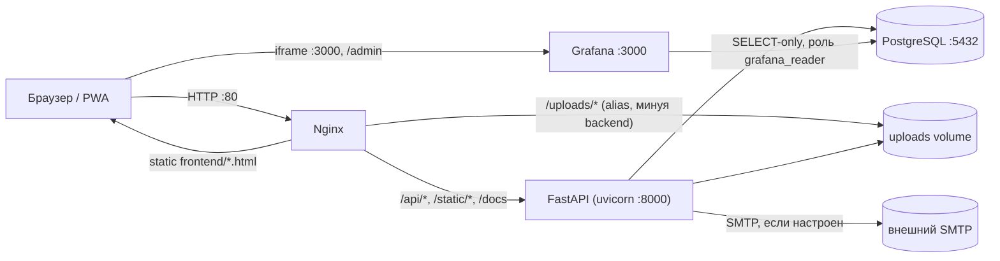

# Архитектура «Чистый берег»

Актуально на Alembic-миграции `99d6ab27f54c` … `b3c8e1f4a927`. Обновляйте этот файл при
значимых архитектурных изменениях.

## Компоненты (docker-compose.yml)



- **backend**: единственный сервис с бизнес-логикой; на старте (`entrypoint.sh`) прогоняет
  `alembic upgrade head`, засеивает справочник учреждений (всегда), затем демо-данные
  (`app/db/seed.py`, только если `SEED_ON_STARTUP=true`), затем поднимает uvicorn.
- **nginx**: единственная точка входа снаружи (порт 80). Раздаёт `frontend/` как статику,
  проксирует `/api/`, `/static/`, `/docs|/redoc|/openapi.json` на backend, отдаёт
  `/uploads/` напрямую с диска (без похода в backend).
- **grafana**: отдельный порт (3000, не через nginx — браузер ходит туда напрямую, в том
  числе для iframe на `/admin`, см. ниже). Ходит в ту же Postgres-БД под read-only ролью
  `grafana_reader` (создаётся миграцией `e5f2a9c31d08`), датасорс и дашборд
  провизионируются из `grafana/provisioning/`. Анонимный доступ уровня Viewer +
  `GF_SECURITY_ALLOW_EMBEDDING=true` включены (`docker-compose.yml`) специально ради
  встраивания в iframe без отдельного логина — это открывает сам дашборд (агрегаты, без
  персональных данных) всем, кто достучится до порта 3000; закрывайте порт файрволом на
  проде, если это нежелательно (см. README, раздел про VDS).
- **db**: Postgres 16, инициализируется **только на первом старте пустого volume**
  значениями `POSTGRES_USER/PASSWORD/DB` из `.env` (стандартное поведение official-образа
  `postgres`) — смена `.env` после первого запуска не меняет пароль уже существующей
  роли внутри уже существующего volume; нужно либо руками поменять пароль роли
  (`ALTER ROLE ... PASSWORD ...` через `psql`), либо снести volume `pgdata` (потеря
  данных). В dev/тестах backend вместо Postgres может работать на SQLite (`DATABASE_URL`
  не задан) — тесты используют in-memory SQLite напрямую через `Base.metadata.create_all`,
  миграции Alembic в тестах не участвуют.

## Backend: слои

```
app/api/v1/*        FastAPI-роутеры (по одному на домен: auth, users, events,
                     admin_tickets, notifications, lessons, reports, sites, gamification, admin)
app/schemas/*        Pydantic-модели запросов/ответов (1:1 с моделями в app/models)
app/services/*        Бизнес-логика, переиспользуемая между роутерами:
                     gamification.py  — award_points/check_achievements/update_streak
                                        (единственное место, где меняются points_total,
                                        включая начисление очков организации-организатору)
                     notifications.py — notify() — единственная точка создания Notification
                     verification.py  — email-код подтверждения (генерация/проверка)
                     email.py         — отправка письма через aiosmtplib (no-op + лог, если SMTP не настроен)
                     gosuslugi.py     — ЗАГЛУШКА интеграции с ЕСИА (is_configured()==False всегда,
                                        пока не заданы GOSUSLUGI_* в .env)
                     inn.py           — проверка контрольной суммы ИНН (10/12 цифр)
app/models/*          SQLAlchemy 2.0 ORM-модели (Mapped[...]), сгруппированы по файлам-доменам
app/core/{config,deps,security}.py   настройки (.env), FastAPI-зависимости (auth/роли), JWT/bcrypt
app/db/seed_institutions.py   идемпотентный сид справочника Team (школы/вузы/колледжи из
                     app/db/data/institutions_rostov.json) — вызывается в entrypoint.sh
                     всегда, отдельно от демо-сида (SEED_ON_STARTUP)
```

Паттерн ролевого доступа: `require_roles(*roles)` в `app/core/deps.py` — фабрика
FastAPI-зависимостей. Для сущностей с владельцем (мероприятия, курсы) используется
дополнительная ручная проверка `_ensure_*_owner(entity, user)` (владелец ИЛИ admin), а не
отдельная роль — это позволяет волонтёру, предложившему мероприятие, управлять именно им.

Волонтёрские механики начисления баллов (`POST /events/{id}/register`, `/checkin`,
`POST /reports` (отправка репорта), `POST /lessons/{id}/complete`) явно ограничены
`role == volunteer` — organizer/admin получают 403. Это отражает разделение ролей и на
фронтенде (см. ниже): организатор/админ физически не видят этих действий в UI, а
проверка на бэкенде — защита от прямых запросов к API в обход интерфейса.

## Данные: сквозные жизненные циклы

**Мероприятие** (`Event.status`): `pending_review` (по умолчанию при создании, автором
может быть волонтёр или организатор, не admin) → `published` (одобрено админом в
`/admin/tickets/events/{id}/approve` или `edit-approve`) | `rejected` (с обязательной
причиной → уведомление автору). Для `event_type=cleanup` обязателен `site_id`
(привязка к `CoastlineSite` — центральная связь с ДЗЗ-историей продукта).

**Заявка на мероприятие** (`EventRegistration.status`): `pending` (при подаче) →
`approved`/`rejected` (решение организатора-владельца, reject требует причины) →
`checked_in` (гео-чекин участника, доступен только из `approved`; начисляет баллы,
обновляет `update_streak`, будущей организации-владельцу события — если есть).

**Курс** (`Lesson.status`): `draft` (создан organizer/admin) → `pending_review`
(`POST /lessons/{id}/submit`) → `published` (тикет `/admin/tickets/courses/{id}/approve`
или `edit-approve`) | `rejected`. Admin-созданные курсы публикуются сразу. Ровно один
курс в системе может иметь `is_base_course=True` (`POST /lessons/{id}/set-base-course`,
admin-only) — его прохождение обязательно перед подачей заявки на `cleanup`-мероприятие
(вместе с `age_verified`). Мероприятие может дополнительно требовать конкретный
опубликованный курс через `Event.prerequisite_lesson_id`
(`POST /events/{id}/attach-course`).

**Тикеты админа** (`app/api/v1/admin_tickets.py`, admin-only) — точка модерации для
мероприятий и курсов: approve / reject (причина обязательна, уходит через `notify()`) /
edit-approve (правки применяются, затем публикация). Репорты о мусоре модерируются
отдельным, более старым эндпоинтом `POST /reports/{id}/moderate` (`require_organizer` —
доступен и организатору, и админу, не только админу, в отличие от мероприятий/курсов),
на фронтенде это отражено в `reports.html` (см. ниже), а не в `tickets.html`.

## Frontend

Multi-page vanilla JS (без сборки), один `js/api.js` на все страницы (JWT в localStorage,
авто-refresh при 401), `js/ui.js` — общие хелперы (skeleton-заглушки, toast, dropdown,
Suggest-подсказки адреса), `js/yamaps.js` — общая обёртка над Яндекс.Картами.

**Дизайн-система — Broadsheet** (`css/style.css`): перенесена из макета `newfront/`
(design canvas + `newfront/_ds/broadsheet-<id>/styles.css` как источник токенов).
Ключевое: бумажный фон `#f3f2f2`, чернильная шапка/подвал `--color-accent-900: #0a303e`,
циан `--color-accent: #0088b0` и маджента `--color-accent-2: #d6006c` как второй акцент,
шрифт Source Serif 4 и для заголовков, и для текста, радиусы 1–4 px (почти прямые углы),
сетки-«ячейки» с 1 px разделителями (`.cells`, `.event-cells`), микро-заголовки капслоком
(`.kicker`, `.micro`). Иконки — Phosphor duotone (CDN, `@import` в начале `css/style.css`).

⚠️ В комментариях внутри `css/style.css` не пишите последовательность «звёздочка + слэш»
(например, в путях вида `_ds/broadsheet-*` + `/styles.css`) — она закрывает комментарий
досрочно и «съедает» блок `:root` с токенами, после чего страница остаётся без стилей.

Разделение по роли — **полное**, не только пункты меню: `js/nav.js` строит для каждой роли
свой набор ссылок (не «общий список + добавки»):

| Роль | Меню |
|---|---|
| volunteer / гость | Главная · Карта ДЗЗ · Уроки · Мероприятия · Репорты · Лидерборд |
| organizer | Главная · Карта ДЗЗ · Курсы → `/lessons` · Мероприятия · Мои мероприятия → `/organizer` · Репорты · Лидерборд |
| admin | Главная · Карта ДЗЗ · Мероприятия · Тикеты → `/tickets` · Мониторинг → `/admin` · Репорты · Лидерборд |

`lessons.html` и `reports.html` (физические файлы на диске не переименованы — см. про
чистые адреса ниже) — одни и те же файлы для всех ролей, но сами адаптируют контент:
`lessons.html` показывает волонтёру прохождение квиза за баллы, а organizer/admin —
только чтение материала и авторские инструменты (если это их курс); `reports.html`
показывает волонтёру форму отправки репорта, а organizer/admin — очередь модерации
(перенесена из `tickets.js`, который теперь отвечает только за мероприятия и курсы).
Форма создания мероприятия живёт только в `organizer.html` (не в `events.html`, который
теперь — чисто участие волонтёра: заявка + гео-чекин), и включает карту Яндекс.Карт для
точной метки места (см. ниже) в дополнение к выбору `CoastlineSite` для уборок.

**Страница действующего мероприятия** — `event.html` + `js/event.js`, адрес `/event?id=…`:
подробности проведения (описание, роли, требования, что взять с собой), точка сбора на
Яндекс.Карте с кругом радиуса гео-чекина и ссылкой на маршрут, статус собственной заявки
(`GET /events/{id}/my-registration`), кнопки «Подать заявку» и «Подтвердить участие»
с показом расстояния до точки ещё до нажатия. `events.html` теперь — только календарь:
каждая карточка ведёт на эту страницу. Колокольчик
уведомлений — выпадающий dropdown (`js/nav.js` + `js/ui.js#initDropdown`), а не переход на
отдельную страницу; `notifications.html` остаётся как полная история.

Каждая страница, доступная не всем ролям (`organizer.html`, `tickets.html`, `admin.html`),
сама проверяет роль при загрузке и показывает «Доступно только …» неавторизованным ролям
(защита на бэкенде обязательна и первична — фронтовая проверка только для UX и для того,
чтобы не показывать элементы интерфейса, которые всё равно приведут к 403).

**`/admin` (Мониторинг)**: шесть KPI-ячеек из `GET /admin/stats`, затем главный элемент —
**окно Grafana**: дашборд `chistybereg-activity` в `<iframe>` внутри рамки с заголовком
(`.grafana-window`, адрес `${location.hostname}:${GRAFANA_PORT}` из `js/config.js`).
Кнопки периода (7/30/90 дней) переключают `from=` в URL дашборда, ссылка «Открыть в новой
вкладке» — фолбэк на случай, если iframe не загрузился (например, mixed content: сайт на
HTTPS, а Grafana только на HTTP — браузер заблокирует именно iframe, но не переход по
ссылке). Под окном — таблица по городам из тех же `/admin/stats`, карта активности
(Яндекс.Карты: участки побережья и мероприятия) и очередь модерации репортов.

**Чистые адреса**: все внутренние ссылки и редиректы используют пути без `.html`
(`/events`, `/profile`, …) — сами файлы на диске остаются `events.html`, `profile.html` и
т.д., это только правило `try_files $uri $uri.html $uri/ /index.html;` в
`nginx/nginx.conf`. Не убирайте суффикс `.html` из имён файлов и не добавляйте его
обратно в новые ссылки внутри `frontend/js/*.js`/`*.html`.

**Логотип и брендинг**: в шапке — текстовый лого «Чистый берег · ORBITAL VIEW»
(`.topbar-brand`), картинка `frontend/logo.png` осталась в подвале (`.footer-logo`).
Шапка и подвал рендерятся из `js/nav.js` (`renderNav`/`renderFooter`) на каждой странице.
Кнопка «Госуслуги» в профиле — картинка (`frontend/icons/gos.png`, класс `.gos-btn`).
Спутник в героблоке главной — `frontend/assets/satellite.webp` (+ `.png`-фолбэк),
пережат из `newfront/assets/satellite-trim.png` (4.7 МБ → 200 КБ).

**Яндекс.Карты / Suggest**: ключи в `frontend/js/config.js` (`YANDEX_MAPS_JS_API_KEY`,
`YANDEX_SUGGEST_API_KEY`) — оба клиентские, привязываются по домену/рефереру в кабинете
developer.tech.yandex.ru, поэтому не секрет и хранятся прямо в исходниках. Там же
`CHECKIN_RADIUS_METERS` — копия backend-настройки `settings.checkin_radius_meters`,
нужная только для подсказок в интерфейсе (решение о зачёте чекина принимает backend).

**Карты во всём проекте — только Яндекс** (Leaflet/OpenStreetMap удалены полностью).
Общая обёртка — `js/yamaps.js`:

- `loadYandexMaps()` — однократная загрузка JS API 2.1 на страницу;
- `createYandexMap(elId, opts)` — карта с человекочитаемой заглушкой, если API недоступен
  (страница продолжает работать), scrollZoom выключен, чтобы карта не «крала» скролл;
- `addYandexPlacemark` / `addYandexRadius` / `fitYandexGeoObjects` — метки, круг радиуса
  гео-чекина, подгонка вида под метки (с ограничением зума: для одной метки `setBounds`
  даёт вырожденный прямоугольник и максимальный зум);
- `YandexImageOverlay` — наложение снимка ДЗЗ на карту по `bounds` слоя. У Яндекс.Карт нет
  готового ImageOverlay, поэтому DOM-слой позиционируется вручную через проекцию карты
  (координаты считаются относительно контейнера: центр в глобальных пикселях минус
  половина размера контейнера) и пересчитывается на `boundschange`/`actiontick`/`sizechange`;
- `geocodeYandex` / `reverseGeocodeYandex` / `yandexRouteUrl` / `haversineMeters`.

Где используются карты: `/map` (базовый слой — спутник Яндекса, поверх — снимок участка
с регулируемой прозрачностью), `/event` (точка сбора + радиус чекина + позиция
пользователя), `/organizer` (выбор точки сбора кликом/перетаскиванием + Suggest-адрес),
`/reports` (координаты находки у волонтёра, карта всех находок у модератора), `/admin`
(география активности), `/tickets` (проверка точек сбора). Автоподсказки адреса —
`js/ui.js#initAddressSuggest` (HTTP Suggest API, `suggest-maps.yandex.ru`).

Учитывайте будущую сборку в Capacitor: страницы должны оставаться относительными путями
(`/api/v1/...` через тот же origin, что и сейчас), без хардкода `localhost`/порта — уже
соблюдается везде в `js/*.js`.

## Продакшн-режим

`ENVIRONMENT=production` в `.env` включает предупреждения в лог backend при старте, если
`CORS_ORIGINS` всё ещё `["*"]` или `JWT_SECRET_KEY` не изменён (см. `app/main.py`) — это
не блокирует запуск, только сигнализирует в логах. `.gitignore` в корне репозитория
исключает `.env`, виртуальные окружения, `uploads/`, `local.db` — сами значения в уже
закоммиченном `.env` не ротировались автоматически, сделайте это вручную перед реальным
продакшеном.
