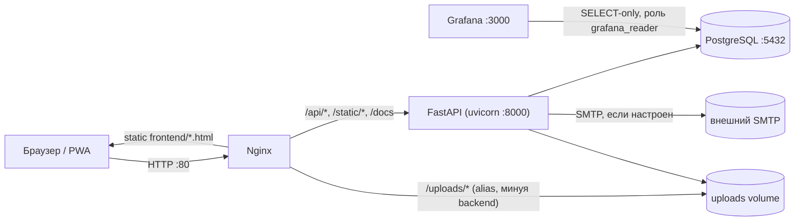

# Архитектура «Чистый берег»

Актуально на: раздел 1–6 нового ТЗ (auth v2 → gamification v6, Alembic-миграции
`99d6ab27f54c` … `a9c4e7f2b615`). Обновляйте этот файл при значимых архитектурных
изменениях (см. `Инструкции.md`).

## Компоненты (docker-compose.yml)



- **backend**: единственный сервис с бизнес-логикой; на старте (`entrypoint.sh`) прогоняет
  `alembic upgrade head`, затем сидирует БД (`app/db/seed.py`), затем поднимает uvicorn.
- **nginx**: единственная точка входа снаружи (порт 80). Раздаёт `frontend/` как статику,
  проксирует `/api/`, `/static/`, `/docs|/redoc|/openapi.json` на backend, отдаёт
  `/uploads/` напрямую с диска (без похода в backend).
- **grafana**: отдельный порт (3000, не через nginx). Ходит в ту же Postgres-БД под
  read-only ролью `grafana_reader` (создаётся миграцией `e5f2a9c31d08`), датасорс и
  дашборд провизионируются из `grafana/provisioning/`.
- **db**: Postgres 16. В dev/тестах backend вместо неё может работать на SQLite
  (`DATABASE_URL` не задан) — тесты используют in-memory SQLite напрямую через
  `Base.metadata.create_all`, миграции Alembic в тестах не участвуют.

## Backend: слои

```
app/api/v1/*        FastAPI-роутеры (по одному на домен: auth, users, events,
                     admin_tickets, notifications, lessons, reports, sites, gamification, admin)
app/schemas/*        Pydantic-модели запросов/ответов (1:1 с моделями в app/models)
app/services/*        Бизнес-логика, переиспользуемая между роутерами:
                     gamification.py  — award_points/check_achievements/update_streak
                                        (единственное место, где меняются points_total,
                                        включая начисление очков организации-организатору)
                     notifications.py — notify() — единственная точка создания Notification
                     verification.py  — email-код подтверждения (генерация/проверка)
                     email.py         — отправка письма через aiosmtplib (no-op + лог, если SMTP не настроен)
                     gosuslugi.py     — ЗАГЛУШКА интеграции с ЕСИА (is_configured()==False всегда,
                                        пока не заданы GOSUSLUGI_* в .env)
                     inn.py           — проверка контрольной суммы ИНН (10/12 цифр)
app/models/*          SQLAlchemy 2.0 ORM-модели (Mapped[...]), сгруппированы по файлам-доменам
app/core/{config,deps,security}.py   настройки (.env), FastAPI-зависимости (auth/роли), JWT/bcrypt
```

Паттерн ролевого доступа: `require_roles(*roles)` в `app/core/deps.py` — фабрика
FastAPI-зависимостей. Для сущностей с владельцем (мероприятия, курсы) используется
дополнительная ручная проверка `_ensure_*_owner(entity, user)` (владелец ИЛИ admin), а не
отдельная роль — это позволяет волонтёру, предложившему мероприятие, управлять именно им.

Волонтёрские механики начисления баллов (`POST /events/{id}/register`, `/checkin`,
`POST /reports` (отправка репорта), `POST /lessons/{id}/complete`) явно ограничены
`role == volunteer` — organizer/admin получают 403. Это отражает разделение ролей и на
фронтенде (см. ниже): организатор/админ физически не видят этих действий в UI, а
проверка на бэкенде — защита от прямых запросов к API в обход интерфейса.

## Данные: сквозные жизненные циклы

**Мероприятие** (`Event.status`): `pending_review` (по умолчанию при создании, автором
может быть волонтёр или организатор, не admin) → `published` (одобрено админом в
`/admin/tickets/events/{id}/approve` или `edit-approve`) | `rejected` (с обязательной
причиной → уведомление автору). Для `event_type=cleanup` обязателен `site_id`
(привязка к `CoastlineSite` — центральная связь с ДЗЗ-историей продукта).

**Заявка на мероприятие** (`EventRegistration.status`): `pending` (при подаче) →
`approved`/`rejected` (решение организатора-владельца, reject требует причины) →
`checked_in` (гео-чекин участника, доступен только из `approved`; начисляет баллы,
обновляет `update_streak`, будущей организации-владельцу события — если есть).

**Курс** (`Lesson.status`): `draft` (создан organizer/admin) → `pending_review`
(`POST /lessons/{id}/submit`) → `published` (тикет `/admin/tickets/courses/{id}/approve`
или `edit-approve`) | `rejected`. Admin-созданные курсы публикуются сразу. Ровно один
курс в системе может иметь `is_base_course=True` (`POST /lessons/{id}/set-base-course`,
admin-only) — его прохождение обязательно перед подачей заявки на `cleanup`-мероприятие
(вместе с `age_verified`). Мероприятие может дополнительно требовать конкретный
опубликованный курс через `Event.prerequisite_lesson_id`
(`POST /events/{id}/attach-course`).

**Тикеты админа** (`app/api/v1/admin_tickets.py`, admin-only) — точка модерации для
мероприятий и курсов: approve / reject (причина обязательна, уходит через `notify()`) /
edit-approve (правки применяются, затем публикация). Репорты о мусоре модерируются
отдельным, более старым эндпоинтом `POST /reports/{id}/moderate` (`require_organizer` —
доступен и организатору, и админу, не только админу, в отличие от мероприятий/курсов),
на фронтенде это отражено в `reports.html` (см. ниже), а не в `tickets.html`.

## Frontend

Multi-page vanilla JS (без сборки), один `js/api.js` на все страницы (JWT в localStorage,
авто-refresh при 401), `js/ui.js` — общие хелперы (skeleton-заглушки, toast, dropdown).
Дизайн-система и анимации живут в `css/style.css` (токены отступов/переходов, `@keyframes`
для появления карточек, skeleton-шиммера, модалок и dropdown; уважает
`prefers-reduced-motion`).

Разделение по роли — **полное**, не только пункты меню: `js/nav.js` строит для каждой роли
свой набор ссылок (не «общий список + добавки»):

| Роль | Меню |
|---|---|
| volunteer / гость | Главная · Карта · Уроки · Мероприятия · Репорты · Лидерборд |
| organizer | Главная · Карта · Курсы → `lessons.html` · Мои мероприятия → `organizer.html` · Репорты → `reports.html` · Лидерборд |
| admin | Главная · Карта · Тикеты → `tickets.html` · Статистика → `admin.html` · Репорты → `reports.html` · Лидерборд |

`lessons.html` и `reports.html` — одни и те же файлы для всех ролей, но сами адаптируют
контент: `lessons.html` показывает волонтёру прохождение квиза за баллы, а
organizer/admin — только чтение материала и авторские инструменты (если это их курс);
`reports.html` показывает волонтёру форму отправки репорта, а organizer/admin — очередь
модерации (перенесена из `tickets.js`, который теперь отвечает только за мероприятия и
курсы). Форма создания мероприятия живёт только в `organizer.html` (не в `events.html`,
который теперь — чисто участие волонтёра: заявка + гео-чекин). Колокольчик уведомлений —
выпадающий dropdown (`js/nav.js` + `js/ui.js#initDropdown`), а не переход на отдельную
страницу; `notifications.html` остаётся как полная история.

Каждая страница, доступная не всем ролям (`organizer.html`, `tickets.html`, `admin.html`),
сама проверяет роль при загрузке и показывает «Доступно только …» неавторизованным ролям
(защита на бэкенде обязательна и первична — фронтовая проверка только для UX и для того,
чтобы не показывать элементы интерфейса, которые всё равно приведут к 403).

Учитывайте будущую сборку в Capacitor (см. `Инструкции.md`): страницы должны оставаться
относительными путями (`/api/v1/...` через тот же origin, что и сейчас), без хардкода
`localhost`/порта — уже соблюдается везде в `js/*.js`.

## Продакшн-режим

`ENVIRONMENT=production` в `.env` включает предупреждения в лог backend при старте, если
`CORS_ORIGINS` всё ещё `["*"]` или `JWT_SECRET_KEY` не изменён (см. `app/main.py`) — это
не блокирует запуск, только сигнализирует в логах. `.gitignore` в корне репозитория
исключает `.env`, виртуальные окружения, `uploads/`, `local.db` — сами значения в уже
закоммиченном `.env` не ротировались автоматически, сделайте это вручную перед реальным
продакшеном.
